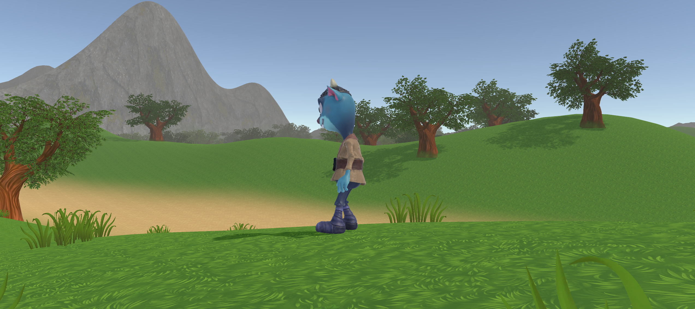

# 🏝️ Mystery Island - Survival and Adventure Game

<p align="center">
  
</p>

**Mystery Island** is a survival and adventure game created in Unity, where players are challenged to explore and survive on a mysterious island. The island’s flora and fauna are dynamically animated using decision trees, meaning their behaviors are influenced by the player’s interactions and environmental conditions, providing a unique experience every time.

## 🚀 Features

- **Exploration and Discovery:** Start your adventure on a secluded beach and explore the vast territory of the island, uncovering resources, caves, ancient ruins, and other hidden mysteries.
    
- **Fauna and Flora Interactions:** The plants and animals react dynamically to the player’s presence and actions, using decision trees to simulate variable behaviors based on factors such as proximity and time of day.
    
- **Survival and Crafting:** Collect natural resources to survive. Craft tools, weapons, and shelters, while managing the island’s resources to prevent over-exploitation.
    
- **Puzzles and Quests:** Solve puzzles and discover artifacts that reveal the island’s mysteries. Think strategically and use logic to overcome challenges based on decision trees.
    
- **Social Interactions:** Meet other survivors or indigenous tribes and navigate complex social interactions managed by decision trees, allowing you to build relationships or avoid conflicts.
    
- **Day/Night Cycles and Weather Changes:** Experience a dynamic day/night cycle and weather changes that affect both the player and the environment’s behavior.
    

## 🛠️ Technologies & Tools

- **Game Engine:** Unity (for graphics development and gameplay)
- **Decision Trees:** Implemented to animate the island’s fauna, flora, and social interactions
- **Scripting:** C# (for game logic and dynamic behaviors)
- **Dynamic Environment:** Implementation of day/night cycles and weather conditions using Unity’s systems
- **Assets and Resources:** Unity Asset Store and custom assets for creating realistic environments
- **Animations:** Dynamically controlled using decision trees to offer adaptive gameplay

## 📦 Installation

1. **Clone this repository:**


```bash
$ git clone https://github.com/YourUsername/Mystery-Island.git 
$ cd Mystery-Island
```

2. **Open the project in Unity:**
    - Open Unity Hub and add the `Mystery-Island` project to your projects list.
    - Open the project in Unity Editor.
3. **Ensure all dependencies are installed:**
    - Use the Unity Package Manager to ensure all necessary packages are installed and up to date.
    - Import any additional assets from the Unity Asset Store as required.

## 🚀 Usage

1. **Island Exploration:**
    - Begin the game by exploring the island and collecting resources necessary for survival.
    
2. **Environment Interactions:**
    - Observe how the island’s flora and fauna react to your presence and adapt your survival strategies accordingly.
    
3. **Crafting and Survival:**
    - Collect resources and use them to craft tools, weapons, and shelters to help you survive.

## 🎉 Contributions

Contributions are welcome! If you have ideas or improvements, please open an issue or submit a pull request.

## 📄 License

This project is licensed under the MIT License - see the LICENSE file for details.
